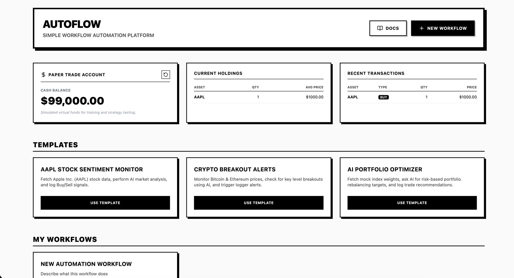

# AutoFlow - Share Market Workflow Automation Platform

AutoFlow is a customizable workflow automation platform designed for stock and cryptocurrency markets. It allows you to build visual orchestrations connecting real-time APIs, AI analysis, logging, and paper trading actions.



---

## 🚀 Key Features

*   **Visual Workflow Canvas:** Drag-and-drop node-based builder to chain triggers, API requests, AI processing, and trades.
*   **Paper Trading Account:**
    *   **Built-in Simulation Mode:** Tracks a virtual `$100,000` cash balance and holdings locally inside MongoDB.
    *   **Alpaca Broker Integration:** Routes market orders directly to Alpaca's Paper Trading sandbox using your API keys.
*   **Built-in Nodes:**
    *   `Timer Trigger`: Delays execution by specified intervals.
    *   `API Call`: Dynamic GET/POST/etc. calls to query markets (Yahoo Finance, CoinGecko, etc.).
    *   `AI Analyst`: Prompt engineering using variables from previous steps (OpenAI, Anthropic, or Local models).
    *   `Paper Trade`: Enforces buy/sell actions with simulation or broker API integrations.
    *   `Logger`: Tracks log alerts in real-time execution panels.
*   **High-Contrast Monochrome UI:** Clean, retro black-and-white design for visual efficiency.

---

## 🛠️ Local Development Setup

### 1. Database Setup (MongoDB)
Ensure MongoDB is running locally on port `27017` (default native Homebrew service):
```bash
brew tap mongodb/brew
brew install mongodb-community@7.0
brew services start mongodb-community@7.0
```

### 2. Backend Service
1. Navigate to the backend directory:
   ```bash
   cd backend
   ```
2. Install dependencies and start the dev server:
   ```bash
   bun install
   bun run dev
   ```
The backend API runs on **`http://localhost:5002`**.

### 3. Frontend App
1. Navigate to the frontend directory:
   ```bash
   cd frontend
   ```
2. Install dependencies and start the dev server:
   ```bash
   bun install
   bun run dev
   ```
The frontend dev server runs on **`http://localhost:5174`**.

---

## 📡 Cloud Deployment

*   **Frontend:** Deployed on **Vercel** with client-side SPA routing rewrites configured inside `vercel.json`.
*   **Backend & MongoDB:** Deployed on **Railway** with custom environment variables and a periodic keep-alive database ping to prevent idle container sleeping.

---

## 🧑‍💻 Developer

Created and maintained by **Sahil Mane** (GitHub: [@sahilmane69](https://github.com/sahilmane69)).
